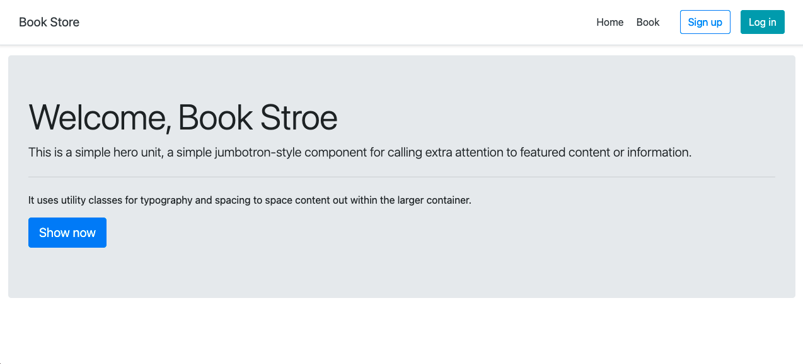

# Python-Django-Bookshop
>Basic Django create bookshop

## Table of Contents
  - [Demo](#demo)
  - [Screenshots](#screenshots)
  - [Technologies](#technologies)
  - [Setup](#setup)
  - [Config project](#config-project)
  - [License](#license)

## Demo
Here is a working live demo: [Basic web Bookshop](https://django-bookshops-basic.herokuapp.com)
## Screenshots
Example web application page
### Home page

### Insert page

### Update page

### Delete page


## Technologies
Project is created with:
- [python3](https://www.python.org/)
- [flask](https://flask.palletsprojects.com/en/1.1.x/)
- [Bootstrap 3](https://getbootstrap.com/docs/3.4/)

## Setup
To clone this project, you need [Git](https://git-scm.com) to install on your computer. command line below:

```zsh
# Clone this repository
$ git clone https://github.com/Bongkot-Kladklaen/Python-Flask-CRUD.git

# Go into the repository
$ cd Python-Flask-CRUD
```
## Config project
1. Create database and table :

    Open project `PHP-VueJS_CRUD` find folder: `database>database.sql` and Import file sql to database server for you
2. Config connect database server : 

    Open project `PHP-VueJS_CRUD` find file: `app.py` to config: hostname, username, password, database
 
    ```python
        # Config database connect
        hostname = 'localhost
        username = 'root'
        password = 'root'
        database = 'flask_db'
    ```

## License
[MIT](LICENSE)